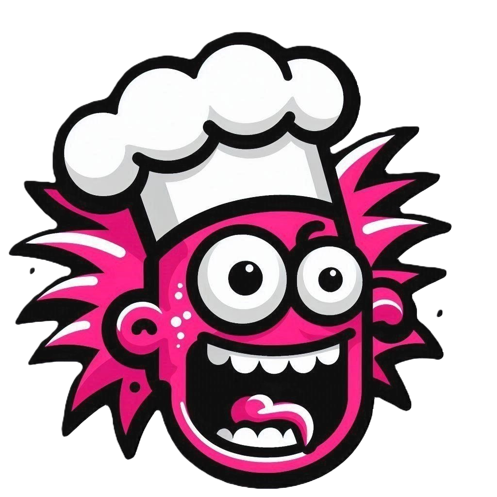

# Purple Dragon - [DEMO](https://gtvault-my.sharepoint.com/:v:/g/personal/akannewurff3_gatech_edu/EaagBIxcNj9AumdBwy5gP1oB9qcL-dDEbtX4xiAWxh7syQ?nav=eyJyZWZlcnJhbEluZm8iOnsicmVmZXJyYWxBcHAiOiJPbmVEcml2ZUZvckJ1c2luZXNzIiwicmVmZXJyYWxBcHBQbGF0Zm9ybSI6IldlYiIsInJlZmVycmFsTW9kZSI6InZpZXciLCJyZWZlcnJhbFZpZXciOiJNeUZpbGVzTGlua0NvcHkifX0&e=DxbwiP)



Welcome to our HackOMSCS project: **_purple dragon_**

Oviously, that's just a codename for now... we'll surely get around to changing it, right?

## Why

Isn't it annoying to have a couple of spare ingredients lying around your house, but not have any idea what to do with them? You shouldn't need to be Gordan Ramsey to whip up a good meal!

That's where we come in. Enter the ingredients you have (TBD: or take a picture of them in your fridge!) and our application will whip up a couple tasty recipes for your to make!

## Design


## Tools/Technologies

### Machine-Learning Model

The main driver of this application is the following hugging face model, which is what actually generates recipes based on the input list of ingredients: https://huggingface.co/flax-community/t5-recipe-generation

### Mongo DB

A NoSQL db chosen specifically for reactive scalability and ease of use. Since each recipe is listed as a single document in the db, we would not have to worry about normalizing columns in the database if we extend the sourcing of recipe data beyond the current ML model. Also store the generated recipe to act as a caching service to improve application performance. This also reduce the number of calls to the ML model.

### Azure Blob Storage

Used to store user uploaded images of the ingredients that they currently have. That way, they can refer back to prior recipes/scenarios in a more visual sense.

### Computer Vision

Utilize CV model to tag user provided images to generate a list of ingredients. Then, use the list of ingredients to query and generate recipes based on those. The ingredients are generated by detecting objects using the CV model https://huggingface.co/facebook/detr-resnet-50 and filtering out non-food related objects using an NER model https://huggingface.co/Dizex/InstaFoodRoBERTa-NER.

### Flask

Quick and easy backend development to tie together the model, database, CV, and frontend with user authentication.

### Vue/PrimeVue

Simple component-driven frontend that allows for rapid development while maintaining customization/configuration.

## Build

To install server:

If on windows, you may need to first follow the steps to update the maximum path length [here](https://learn.microsoft.com/en-us/windows/win32/fileio/maximum-file-path-limitation?tabs=powershell#enable-long-paths-in-windows-10-version-1607-and-later)

```
cd backend
pip install -r requirements.txt
```

To install front:

```
cd front
npm install
```

## Run

To run server:

```
cd backend
python3 app.py
```

To run front:

```
cd front
npm run dev
```

## Next Steps:

Generate an image for each of the recipes provided to then display on UI

# Team Members

- Sumayyah Chougle (schougle3@gatech.edu)
- Cong Feng (cfeng80@gatech.edu)
- Alejandro Gomez (agomez302@gatech.edu)
- Kevin Tran (ktran347@gatech.edu)
- Adam von Kannewurff (akannewurff3@gatech.edu)
